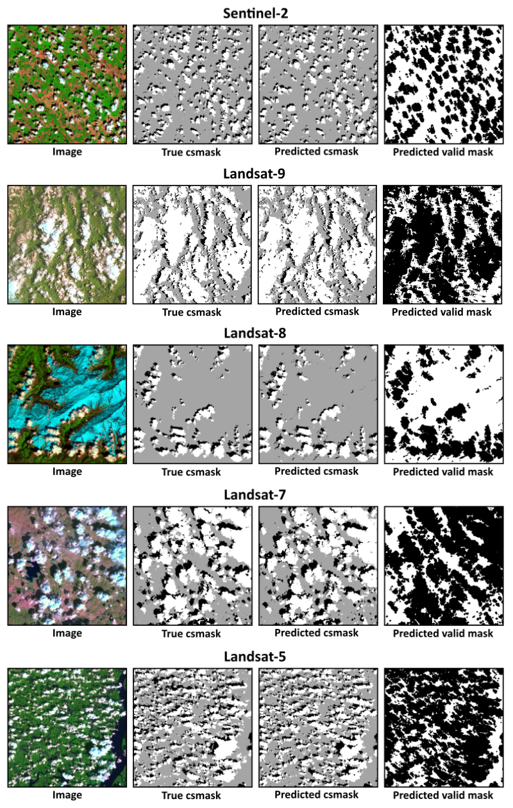

# [](https://www.dlr.de/eoc/en/desktopdefault.aspx/tabid-5413/10560_read-21914/) ukis-csmask


[](https://codecov.io/gh/dlr-eoc/ukis-csmask)

[](https://pypi.python.org/pypi/ukis-csmask/)
[](LICENSE)
[](https://black.readthedocs.io/en/stable/)

UKIS Cloud Shadow MASK (ukis-csmask) package masks clouds and cloud shadows in Sentinel-2, Landsat-8, Landsat-7 and Landsat-5 images. Masking is performed with a pre-trained convolution neural network. It is fast and works directly on Level-1C data (no atmospheric correction required). Images just need to be in Top Of Atmosphere (TOA) reflectance and include at least the "Blue", "Green", "Red", "NIR", "SWIR1" and "SWIR2" spectral bands. Best performance (in terms of accuracy and speed) is achieved when images are resampled to approximately 30 m spatial resolution.

This [publication](https://doi.org/10.1016/j.rse.2019.05.022) provides further insight into the underlying algorithm and compares it to the widely used [Fmask](http://www.pythonfmask.org/en/latest/) algorithm across a heterogeneous test dataset. If you use ukis-csmask in your work, please consider citing us as follows.
> Wieland, M.; Li, Y.; Martinis, S. Multi-sensor cloud and cloud shadow segmentation with a convolutional
neural network. *Remote Sensing of Environment*, 2019, 230, 1-12. [https://doi.org/10.1016/j.rse.2019.05.022](https://doi.org/10.1016/j.rse.2019.05.022)



## Example
Here's an example on how to compute a cloud and cloud shadow mask from an image. Please note that here we use [ukis-pysat](https://github.com/dlr-eoc/ukis-pysat) for convencience image handling, but you can also work directly with [numpy](https://numpy.org/) arrays.

````python
from ukis_csmask.mask import CSmask
from ukis_pysat.raster import Image, Platform

# read Level-1C image from file, convert digital numbers to TOA reflectance
# and make sure resolution is 30 m to get best performance
img = Image(data="sentinel2.tif", dimorder="last")
img.dn2toa(platform=Platform.Sentinel2)
img.warp(
    resampling_method=0,
    resolution=30,
    dst_crs=img.dataset.crs
)

# compute cloud and cloud shadow mask
# NOTE: band_order must match the order of bands in the input image. it does not have to be in this explicit order,
# but needs to include these six spectral bands.
csmask = CSmask(
    img=img.arr,
    band_order=["Blue", "Green", "Red", "NIR", "SWIR1", "SWIR2"],
    nodata_value=0,
)

# access cloud and cloud shadow mask
csmask_csm = csmask.csm

# access valid mask
csmask_valid = csmask.valid

# convert results to UKIS-pysat Image
csmask_csm = Image(csmask.csm, transform=img.dataset.transform, crs=img.dataset.crs, dimorder="last")
csmask_valid = Image(csmask.valid, transform=img.dataset.transform, crs=img.dataset.crs, dimorder="last")

# write results back to file
csmask_csm.write_to_file("sentinel2_csm.tif", dtype="uint8", compress="PACKBITS")
csmask_valid.write_to_file("sentinel2_valid.tif", dtype="uint8", compress="PACKBITS", kwargs={"nbits":2})
````

## Installation
The easiest way to install ukis-csmask is through pip.

```shell
pip install ukis-csmask
```

For a list of dependencies check the [requirements](https://github.com/dlr-eoc/ukis-csmask/blob/main/requirements.txt).

## Contributors
The UKIS team creates and adapts libraries which simplify the usage of satellite data. Our team includes (in alphabetical order):
* Boehnke, Christian
* Fichtner, Florian
* Mandery, Nico
* Martinis, Sandro
* Riedlinger, Torsten
* Wieland, Marc

German Aerospace Center (DLR)

## Licenses
This software is licensed under the [Apache 2.0 License](https://github.com/dlr-eoc/ukis-csmask/blob/main/LICENSE).

Copyright (c) 2020 German Aerospace Center (DLR) * German Remote Sensing Data Center * Department: Geo-Risks and Civil Security

## Changelog
See [changelog](https://github.com/dlr-eoc/ukis-csmask/blob/main/CHANGELOG.rst).

## Contributing
The UKIS team welcomes contributions from the community.
For more detailed information, see our guide on [contributing](https://github.com/dlr-eoc/ukis-csmask/blob/main/CONTRIBUTING.md) if you're interested in getting involved.

## What is UKIS?
The DLR project Environmental and Crisis Information System (the German abbreviation is UKIS, standing for [Umwelt- und Kriseninformationssysteme](https://www.dlr.de/eoc/en/desktopdefault.aspx/tabid-5413/10560_read-21914/) aims at harmonizing the development of information systems at the German Remote Sensing Data Center (DFD) and setting up a framework of modularized and generalized software components.

UKIS is intended to ease and standardize the process of setting up specific information systems and thus bridging the gap from EO product generation and information fusion to the delivery of products and information to end users.

Furthermore the intention is to save and broaden know-how that was and is invested and earned in the development of information systems and components in several ongoing and future DFD projects.
